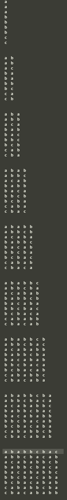
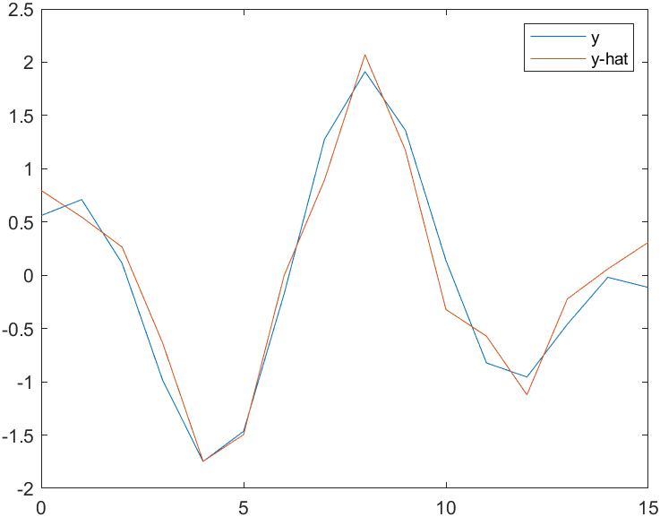
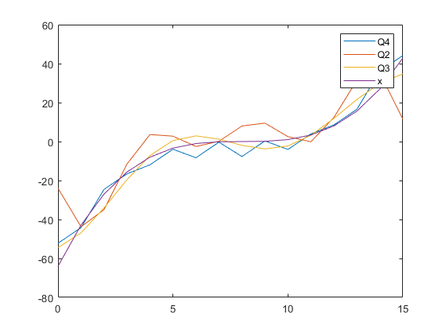
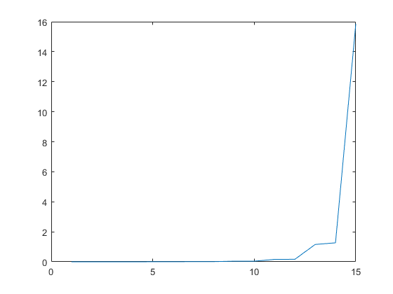

# **Assignment 2**


## **Question 1**

### **Part a**
```y, L = bbbcacaab 0```

```y, L = ethtthch htt Twaaai  , 4 ```


### **Part b**

```
reconstructB(y, L):
    B <-- new matrix
    for i in range( len(y) ):
        add y to B
        sort B by rows lexicographically
    
    return B
```

### **Part c**

```
reconstructx(y, L):
    B <-- reconstructB(y, L)

    x <-- B[L]

    return x
```

### **Part d**


| Input    | All Rotations    | Sorted    | y    | L    |
| :------------- | :----------: |:----------: | :----------:| -----------: |
|ababbcbac| ababbcbac |  ababbcbac  | cbbacabab| 0
|-        | babbcbaca |  abbcbacab  |-|-
|-        | abbcbacab |  acababbcb  |-|-
|-        | bbcbacaba |  babbcbaca  |-|-
|-        | bcbacabab |  bacababbc  |-|-
|-        | cbacababb |  bbcbacaba  |-|-
|-        | bacababbc |  bcbacabab  |-|-
|-        | acababbcb |  cababbcba  |-|-
|-        | cababbcba |  cbacababb  |-|-

```y, L = cbbacabab, 0```


Reconstruction:



Knowing that L is 0, we can look at the 0th row in the final matrix at the bottom and find the orignal x, 'ababbcbac'


## **Question 2**
### **Part a**
| X     | abs(X)     | X_hat     |
| :------------- | :----------: | -----------: |
|  -64.0000000000000 + 0.00000000000000i|64               |0.00000000000000 + 0.00000000000000i
-64.0000000000000 - 123.616177165273i   |139.201146751585 |-64.0000000000000 - 123.616177165273i
-64.0000000000000 - 129.781745930520i   |144.704186452135 |-64.0000000000000 - 129.781745930520i
-64.0000000000000 - 88.5096491125439i   |109.224347038678 |-64.0000000000000 - 88.5096491125439i
-64.0000000000000 - 61.0000000000000i   |88.4137998278549 |0.00000000000000 + 0.00000000000000i
-64.0000000000000 - 41.3136896196506i   |76.1762492512517 |0.00000000000000 + 0.00000000000000i
-64.0000000000000 - 25.7817459305202i   |68.9978146264496 |0.00000000000000 + 0.00000000000000i
-64.0000000000000 - 12.4202176723800i   |65.1940319893570 |0.00000000000000 + 0.00000000000000i
-64.0000000000000 + 0.00000000000000i   |64               |0.00000000000000 + 0.00000000000000i
-64.0000000000000 + 12.4202176723800i   |65.1940319893570 |0.00000000000000 + 0.00000000000000i
-64.0000000000000 + 25.7817459305202i   |68.9978146264496 |0.00000000000000 + 0.00000000000000i
-64.0000000000000 + 41.3136896196506i   |76.1762492512517 |0.00000000000000 + 0.00000000000000i
-64.0000000000000 + 61.0000000000000i   |88.4137998278549 |0.00000000000000 + 0.00000000000000i
-64.0000000000000 + 88.5096491125439i   |109.224347038678 |-64.0000000000000 + 88.5096491125439i
-64.0000000000000 + 129.781745930520i   |144.704186452135 |-64.0000000000000 + 129.781745930520i
-64.0000000000000 + 123.616177165273i   |139.201146751585 |-64.0000000000000 + 123.616177165273i


| Y     | abs(Y)     | Y_hat     |
| :------------- | :----------: | -----------: |
|-0.672371817092243 + 0.00000000000000i  |0.672371817092243  |0.00000000000000 + 0.00000000000000i
|-2.82044614666497 - 1.71736205248899i   |3.30215821631346   |-2.82044614666497 - 1.71736205248899i
|10.1001352708745 + 1.16929927043018i    |10.1675952552111   |10.1001352708745 + 1.16929927043018i
|-3.00390868182583 + 1.79548718923918i   |3.49960592288198   |-3.00390868182583 + 1.79548718923918i
|-0.285120266061179 + 0.791046351673850i |0.840861401549212  |0.00000000000000 + 0.00000000000000i
|0.117560245577081 + 0.470415738793309i  |0.484882850433585  |0.00000000000000 + 0.00000000000000i
|0.251076955046580 + 0.277348552317849i  |0.374114764247910  |0.00000000000000 + 0.00000000000000i
|0.304205135549820 + 0.130202031658665i  |0.330897769020779  |0.00000000000000 + 0.00000000000000i
|0.318935195078162 + 0.00000000000000i   |0.318935195078162  |0.00000000000000 + 0.00000000000000i
|0.304205135549820 - 0.130202031658665i  |0.330897769020779  |0.00000000000000 + 0.00000000000000i
|0.251076955046580 - 0.277348552317849i  |0.374114764247910  |0.00000000000000 + 0.00000000000000i
|0.117560245577081 - 0.470415738793309i  |0.484882850433585  |0.00000000000000 + 0.00000000000000i
|-0.285120266061179 - 0.791046351673850i |0.840861401549212  |0.00000000000000 + 0.00000000000000i
|-3.00390868182583 - 1.79548718923918i   |3.49960592288198   |-3.00390868182583 - 1.79548718923918i
|10.1001352708745 - 1.16929927043018i    |10.1675952552111   |10.1001352708745 - 1.16929927043018i
|-2.82044614666497 + 1.71736205248899i   |3.30215821631346   |-2.82044614666497 + 1.71736205248899i


|x | x_hat|
| :------------- | ----------: |
|-64|-24
|-42.8750000000000|-43.7153165735026
|-27|-34.9721695195455
|-15.6250000000000|-11.5266809833590
|-8|3.61168399340883
|-3.37500000000000|2.75656956972698
|-1|-2.52673303691548
|-0.125000000000000|0.132079019944577
|0|8
|0.125000000000000|9.45921991909269
|1|2.52673303691548
|3.37500000000000|-0.101998673081372
|8|12.3883160065912
|15.6250000000000|31.4995270846829
|27|34.9721695195455
|42.8750000000000|11.4966006364958

|y | y_hat|
| :------------- | ----------: |
|0.560848025186123|0.534472555297965
|0.710921117351991|0.651875361516528
|0.111575007354422|0.169283710889161
|-0.984182560990524|-0.861610226458211
|-1.74821079219786|-1.70162306407534
|-1.46418183837943|-1.49229302141393
|-0.176839039693525|-0.155473007394864
|1.27775986032829|1.38399513875874
|1.91149538702710|1.99056126242067
|1.35974469626457|1.34029803455709
|0.138513160937195|0.123041106718385
|-0.822842762941691|-0.717153447936574
|-0.955051908549474|-0.823410753643294
|-0.458787552442807|-0.499880374659689
|-0.0190481510710230|-0.136851810212681
|-0.114084465275597|0.194768535636048
### **Part b**



### **Part c**

``` mse(x, x_hat) = 208.8```

``` mse(y, y_hat) = 0.0115```

### **Part d**

```snr(x, x_hat) = 1.794```

```snr(y, y_hat) = 0.501```


## **Question 3**

### **Part a**
|X | X_hat|
| :------------- | ----------: |
|-16.0000000000000|-16.0000000000000
|-84.3925742766909|-84.3925742766909
|-13.6662308878471|-13.6662308878471
|-43.9646299590142|-43.9646299590142
|-3.34566374608150|-3.34566374608150
|-16.3338083634380|0
|-1.42861336962544|0
|-8.03325611408054|0
|-0.750000000000000|0
|-4.46883615393278|0
|-0.426179416775374|0
|-2.55892619105595|0
|-0.237769001671661|0
|-1.34043281209945|0
|-0.107555868735764|0
|-0.418760225563996|0

|Y | Y_hat|
| :------------- | ----------: |
|-0.168092954273061|-0.168092954273061
|-4.02175206550312e-16|-4.02175206550312e-16
|-0.859563015680959|-0.859563015680959
|1.75413162110037|1.75413162110037
|3.14091062002642|3.14091062002642
|-0.821049055044716|0
|-1.23573204082214|0
|3.95285218939724e-16|0
|-0.269041654433757|0
|-2.34161306779357e-16|0
|-0.115195974496117|0
|-1.17756934401283e-16|0
|-0.0566228694781970|0
|-7.85046229341888e-17|0
|-0.0241663494448963|0
|7.87159093625987e-17|0


|x | x_hat|
| :------------- | ----------: |
|-64|-54.3998691788416
|-42.8750000000000|-46.8835196321736
|-27|-34.0694026587461
|-15.6250000000000|-19.5870086752102
|-8|-7.18466775870520
|-3.37500000000000|0.540836557184180
|-1|2.91903029454277
|-0.125000000000000|1.23364640680428
|0|-1.94150319017603
|0.125000000000000|-3.78946664140808
|1|-2.26676211692651
|3.37500000000000|3.25558024003221
|8|11.8874165374428
|15.6250000000000|21.6059883902682
|27|29.9432958072591
|42.8750000000000|34.7364056186537

|y | y_hat|
| :------------- | ----------: |
|0.560848025186123|1.27933857119747
|0.710921117351991|0.523691619485419
|0.111575007354422|-0.575035775214032
|-0.984182560990524|-1.41961127994718
|-1.74821079219786|-1.55563359445319
|-1.46418183837943|-0.915339651138115
|-0.176839039693525|0.156218709980129
|1.27775986032829|1.10195965879771
|1.91149538702710|1.46201668627984
|1.35974469626457|1.11502869155700
|0.138513160937195|0.319046048686821
|-0.822842762941691|-0.461735177499571
|-0.955051908549474|-0.834910394486530
|-0.458787552442807|-0.696612155073805
|-0.0190481510710230|-0.263183396829538
|-0.114084465275597|0.0923896215653293

### **Part b**


### **Part c**

``` mse(x, x_hat) = 22.67```

``` mse(y, y_hat) = 0.1432```

### **Part d**

```snr(x, x_hat) =0.1626```

```snr(y, y_hat) = 0.6710```

## **Question 4**

### **Part a**
|X | X_hat|
| :------------- | ----------: |
|-64|-64|
|-64|-64|
|-125|-125|
|-3|0|
|-226|-226|
|-6|0|
|-12|0|
|-12|0|
|-260|-260|
|-12|0|
|-24|0|
|-24|0|
|-48|0|
|-48|0|
|-96|-96|
|0|0|

|Y | Y_hat|
| :------------- | ----------: |
|-0.672371817092243|0|
|0.318935195078162|0|
|0.505926085612671|0|
|-1.07616661773503|0|
|6.64451595747060|6.64451595747060|
|4.59864698656283|4.59864698656283|
|11.6939666773281|11.6939666773281|
|-2.23470516951931|0|
|-2.75224862498878|-2.75224862498878|
|-1.90482195040049|0|
|-4.84379959568833|-4.84379959568833|
|0.925645189120164|0|
|-1.62324915978154|0|
|0.769977673475807|0|
|1.22141361744444|0|
|-2.59809604390908|-2.59809604390908|


|x | x_hat|
| :------------- | ----------: |
|-64|-52.1875000000000
|-42.8750000000000|-44.1875000000000
|-27|-24.5625000000000
|-15.6250000000000|-16.5625000000000
|-8|-11.9375000000000
|-3.37500000000000|-3.93750000000000
|-1|-8.31250000000000
|-0.125000000000000|-0.312500000000000
|0|-7.68750000000000
|0.125000000000000|0.312500000000000
|1|-4.06250000000000
|3.37500000000000|3.93750000000000
|8|8.56250000000000
|15.6250000000000|16.5625000000000
|27|36.1875000000000
|42.8750000000000|44.1875000000000

| y      | y_hat     |
| :------------- | -----------: |
|0.560848025186123|0.796436584798458
|0.710921117351991|0.546367716966739
|0.111575007354422|0.264927705082124
|-0.984182560990524|-0.634665173726865
|-1.74821079219786|-1.74594261238310
|-1.46418183837943|-1.49587374455138
|-0.176839039693525|-0.00348383374468014
|1.27775986032829|0.896109045064309
|1.91149538702710|2.07070461787173
|1.35974469626457|1.17111173906274
|0.138513160937195|-0.321278171743955
|-0.822842762941691|-0.571347039575674
|-0.955051908549474|-1.12119859028709
|-0.458787552442807|-0.221605711478104
|-0.0190481510710230|0.0598343004065112
|-0.114084465275597|0.309903168238230

### **Part b**

``` mse(x, x_hat) = 24.363```

``` mse(y, y_hat) = 0.0632```

### Part c


### **Part d**

#### MSE(x, x_hat)
##### Q2
``` mse(x, x_hat) = 208.8```

``` mse(y, y_hat) = 0.0115```
##### Q3
``` mse(x, x_hat) = 22.67```

``` mse(y, y_hat) = 0.1432```
##### Q4
``` mse(x, x_hat) = 24.363```

``` mse(y, y_hat) = 0.0632```


The DCT transform has the best mse(x, x_hat) at 22.67

The Fourier transform has the best mse(y, y_hat) at 0.0115

## Question 5

### **Part a**



### **Part b**
We can see that as n grows larger, the fidelity of the decompressed data becomes better. The growth seems to be exponential. This makes sense as we would be better able to reconstruct the data with more degrees of freedom.


## Appendix 

### Question 1 Code
Python
```
def listify(s):
    return [c for c in s]

def stringify(x):
    return "".join(x) 

def get_rotations(s):
    res = []
    for i in range(len(s)):
        res.append( stringify(s[i:] + s[:i]) )
    return res

def BWT(x):
   A = [i for i in get_rotations( x )]

   A_prime = ["".join(i) for i in A]
   B = sorted(A_prime)
   
   last_col = [listify(B[i])[-1] for i in range(len(B))]
   return last_col, B.index(stringify(x)), B

def reconstructB(y, L):
    B = [[] for i in range(len(y))]
    
    for i in range(len(y)):
        #add to cols
        for j in range(len(y)):
            B[j].insert(0, y[j])
    
        
        B.sort(key=lambda x: "".join(x))
        p = PrettyTable()
        for row in B:
            p.add_row(row)
        print(p.get_string(header=False, border=False))
        print('\n')

def reconstruct_x(y, L):
    B = reconstruct_B(y)
    x = B[L]
    return listify(x)

input_string = 'ababcbacb'
x = listify(input_string)
y, L, B = BWT(x)
print(y, L)

```

### Question 2 Code
Matlab
```
x_range = 0:1:15
x = ((x_range - 8).^3) / 8
y = cos((3*x_range+1) * pi/16 + 1) + sin((5*x_range+1) * pi/16)

X = fft(x)
Y = fft(y)

absX = abs(X)
absY = abs(Y)

X_hat = X(:, :)
Y_hat = Y(:, :)

[Bx,Ix] = mink(absX, 10)
[By,Iy] = mink(absY, 10) 

X_hat(Ix) = 0
Y_hat(Iy) = 0

x_hat = ifft(X_hat)
y_hat = ifft(Y_hat)

plot(x_range, x, '-', x_range, x_hat)
legend('x', 'x-hat')

plot(x_range, y, '-', x_range, y_hat)
legend('y', 'y-hat')

immse(x, x_hat)
immse(y, y_hat)

snr(x, x_hat)
snr(y, y_hat)
```

### Question 3 Code
Matlab
```
x_range = 0:1:15
x = ((x_range - 8).^3) / 8
y = cos((3*x_range+1) * pi/16 + 1) + sin((5*x_range+1) * pi/16)

X = dct(x)
Y = dct(y)

absX = abs(X)
absY = abs(Y)

X_hat = X(:, :)
Y_hat = Y(:, :)

X_hat(end-10:end) = 0
Y_hat(end-10:end) = 0

x_hat = idct(X_hat)
y_hat = idct(Y_hat)

plot(x_range, x, '-', x_range, x_hat)
legend('x', 'x-hat')

plot(x_range, y, '-', x_range, y_hat)
legend('y', 'y-hat')

immse(x, x_hat)
immse(y, y_hat)

snr(x, x_hat)
snr(y, y_hat)
```


### Question 4 Code
Matlab
```
x_range = 0:1:15
x = ((x_range - 8).^3) / 8
y = cos((3*x_range+1) * pi/16 + 1) + sin((5*x_range+1) * pi/16)

x = reshape(x, [16,1])
y = reshape(y, [16, 1])

H = hadamard(16)

X = H*x
Y = H*y

absX = abs(X)
absY = abs(Y)

X_hat = X(:, :)
Y_hat = Y(:, :)

[Bx,Ix] = mink(absX, 10)
[By,Iy] = mink(absY, 10) 

X_hat(Ix) = 0
Y_hat(Iy) = 0

x_hat = inv(H) * X_hat
y_hat = inv(H) * Y_hat

plot(x_range, x, '-', x_range, x_hat)
legend('x', 'x-hat')

plot(x_range, y, '-', x_range, y_hat)
legend('y', 'y-hat')

immse(x, x_hat)
immse(y, y_hat)

snr(x, x_hat)
snr(y, y_hat)


... code for other transforms above
```

### Question 5 Code
Matlab
```
x_range = 1:1:15

range = 0:1:15
x = ((range - 8).^3) / 8
X = dct(x)

res = []
for c = 1:15
    X_hat_n = X(:, :)
    
    X_hat_n(end-c+1:end) = 0
    x_hat_n = idct(X_hat_n)
    res(c) = snr(x, x_hat_n)
end

plot(x_range, res)
```